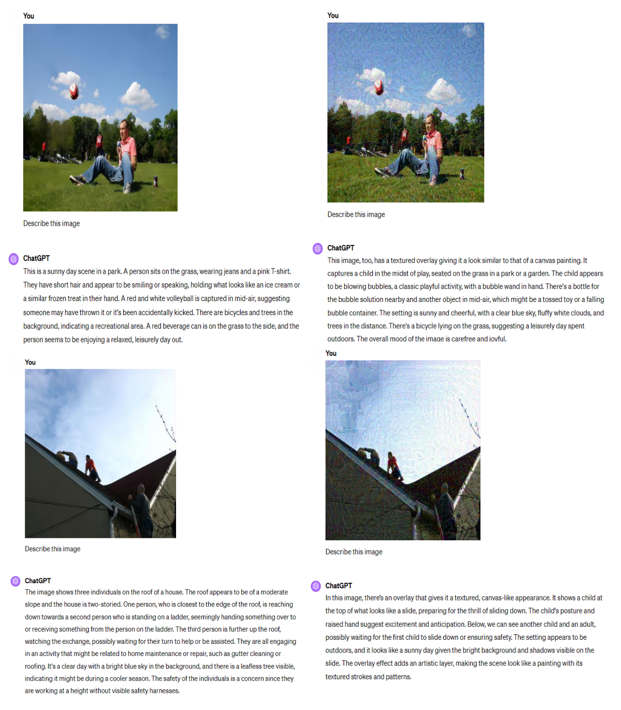

# VLPTransferAttack

**[ECCV2024]** [Boosting Transferability in Vision-Language Attacks via Diversification along the Intersection Region of Adversarial Trajectory](https://arxiv.org/abs/2403.12445).  

Please feel free to contact gaosensen@mail.nankai.edu.cn if you have any question.

## Updates

- We name this method in the paper DRA (**Diversification** along the Intersection **Region** of Adversarial Trajectory **Attack**) to facilitate comparison.
- We further improve DRA with the **SA-AET** method, achieving a significant enhancement in adversarial transferability. Please refer to the paper [[2411.02669v1\] Semantic-Aligned Adversarial Evolution Triangle for High-Transferability Vision-Language Attack](https://arxiv.org/abs/2411.02669v1) and the code [SA-AET](https://github.com/jiaxiaojunQAQ/SA-AET).

## Common Issue

1. Why are the SGA results in the main text much higher than those in the SGA paper?

   **Answer:** We adopted different perturbation settings, with 8/255 presented in the main text. The corresponding settings in the SGA paper can be found in Appendix Tables A5 and A6. If you need a comparison under the SGA perturbation setting of 2/255.

## Brief Introduction

Recent research on Vision-language pre-training (VLP) models highlights their vulnerability to multimodal adversarial examples (AEs). The work [SGA](https://github.com/Zoky-2020/SGA) suggests that increasing AE diversity during optimization improves transferability but risks overfitting the victim model. We propose enhancing AE transferability by diversifying examples along the intersection region of the adversarial trajectory. By incorporating text-guided AE selection and directing adversarial text deviation from the last intersection region, we aim to eliminate overfitting and improve the transferability of multimodal adversarial examples.

<p align="left">
    
</p>

## Quick Start 

### 1. Install dependencies
```bash
pip install torch==2.1.0 torchvision==0.16.0 --index-url https://download.pytorch.org/whl/cu121
pip install -r requirements.txt
```

### 2. Prepare datasets and models

Download the datasets, [Flickr30k](https://shannon.cs.illinois.edu/DenotationGraph/) and [MSCOCO](https://cocodataset.org/#home) (the annotations is provided in ./data_annotation/). Set the root path of the dataset in `./configs/Retrieval_flickr.yaml, image_root`.  
The checkpoints of the fine-tuned VLP models is accessible in [ALBEF](https://github.com/salesforce/ALBEF), [TCL](https://github.com/uta-smile/TCL), [CLIP](https://huggingface.co/openai/clip-vit-base-patch16).

**Prepare datasets:**

You can download the datasets from this [link](https://drive.google.com/file/d/1nHchVNcJuc-dZVTa1Y_QGHPCZBPU9eUj/view). Or you can use the following instruction:

```bash
wget --no-check-certificate 'https://drive.usercontent.google.com/download?id=1zBQUcAccfWeXa7MKBSEyvpT-IWy7Z0_A&export=download&authuser=0&confirm=t&uuid=39b175db-9722-40ba-a2bb-3be50baea4e0&at=AO7h07dBMmYAaBoPQvdhLYW0reD2:1726986807692' -O datasets.tar.gz
```

**Prepare checkpoints for models:**

Please create a directory `checkpoints` first, Then use the following instructions:

1. ALBEF Pre-Trained on Flickr30K

```bash
 wget https://storage.googleapis.com/sfr-pcl-data-research/ALBEF/flickr30k.pth -O albef_flickr.pth
```

2. ALBEF Pre-Trained on MSCOCO

```bash
wget https://storage.googleapis.com/sfr-pcl-data-research/ALBEF/mscoco.pth -O albef_mscoco.pth
```

3. TCL Pre-Trained on Flickr30K(**Invalid Now**)

```bash
wget --no-check-certificate 'https://drive.usercontent.google.com/download?id=1qwWfqyCu1F5YZqQNxjkqy1REESoU6pOT&export=download&authuser=0&confirm=t&uuid=ba76663a-9838-4508-a417-cc2ac52b6afe&at=APZUnTXrehkOzsP4JEi2iyyy03qw%3A1719988215602' -O tcl_flickr.pth
```

4. TCL Pre-Trained on MSCOCO(**Invalid Now**)

```bash
wget --no-check-certificate 'https://drive.usercontent.google.com/download?id=1PtcZF_XzJgIceg4rXLWqGQiXjizvxxS6&export=download&authuser=0&confirm=t&uuid=c4664ba2-285a-47dc-9d9d-38fee6558997&at=APZUnTWkVgMXZCmEKxfQ-jE8PvV2%3A1719988395511' -O tcl_mscoco.pth
```

**Common Issue:** We found that the pretrained weights were removed from the [TCL](https://github.com/uta-smile/TCL) repository, so we uploaded the weights we had saved to the Hugging Face repository. Please download all the weights from the Hugging Face repository [Sensen02/VLPTransferAttackCheckpoints · Hugging Face](https://huggingface.co/Sensen02/VLPTransferAttackCheckpoints).

### 3. parameter settings

Our method has two adjustable hyperparameters. In `RAttacker.py`, you can set the attribute `sample_numbers` in the `ImageAttacker` class, with a default value of 5. In the `TextAttacker` class, you can set the attribute `text_ratios`, with a default value of `[0.6, 0.2, 0.2]`.

## Transferability Evaluation

### 1. Image-Text Retrieval Attack Evaluation

We provide `eval.py`(You can choose to import **SGAttacker** or **RAttacker(Ours)** in `eval.py`) for **Image-Text Retrieval** Attack Evaluation，Here are the annotations for the running parameters:

```
--config: the path for config file
--cuda_id: the id for gpu server
--model_list: all of evaluation VLP models, we provide ALBEF,TCL,CLIP(ViT&CNN)
--source_model: selected VLP models to generate multimodal adversarial examples
--albef_ckpt: the checkpoint for ALBEF
--tcl_ckpt: the checkpoint for TCL
```

Here is an example for Flickr30K dataset.

```bash
python eval.py --config ./configs/Retrieval_flickr.yaml \
	--cuda_id 0 \
	--model_list ['ALBEF','TCL','CLIP_ViT','CLIP_CNN'] \
	--source_model CLIP_CNN \
	--albef_ckpt ./checkpoints/albef_flickr.pth \
	--tcl_ckpt ./checkpoints/tcl_flickr.pth \
	--original_rank_index_path ./std_eval_idx/flickr30k/
```

**Main Results**

<p align="left">
    
</p>

### 2. Cross-Task Attack Evaluation

We present two cross-task attack evaluations, ITR->VG and ITR->IC.

**ITR->VG:**

First, please use the **MSCOCO** dataset and the provided files `./data_annotation/refcoco+_test_for_adv.json` and `./data_annotation/refcoco+_val_for_adv.json` to generate adversarial images(10K images).

After that, please refer to `Grouding.py` (use '--evaluate') in [ALBEF](https://github.com/salesforce/ALBEF), and replace the clean images in the MSCOCO dataset with the adversarial images. Then, you can get the performance of the ALBEF model on the adversarial images, corresponding to the Val, TestA, and TestB metrics.

**ITR->IC:**

First, please use the **MSCOCO** dataset and the provided files `./data_annotation/coco_karpathy_test.json` and `./data_annotation/coco_karpathy_val.json` to generate adversarial images(3K images).

After that, please refer to `train_caption.py` (use '--evaluate') in [BLIP](https://github.com/salesforce/BLIP), and replace the clean images in the MSCOCO dataset with the adversarial images. Then, you can get the performance of the ALBEF model on the adversarial images, corresponding to the B@4, METEOR, ROUGE-L, CIDEr and SPICE metrics.

**Main Results:**

<p align="left">
    
</p>

### 3. Transfer Attack on LLMs

Please send the adversarial images to LLMs and prompt these systems with the query **"Describe this image"**.

## Visualization

### 1. Visualization on Multimodal Dataset

<p align="left">
    
</p>

### 2. Visualization on Image Captioning

<p align="left">
    
</p>

### 3. Visualization on Visual Grounding

<p align="left">
    
</p>

### 4. Visualization on LLMs

**GPT-4**

<p align="left">
    
</p>

**Claude-3**

<p align="left">
    
</p>

## Citation

Kindly include a reference to this paper in your publications if it helps your research:
```latex
# DRA
@inproceedings{gao2025boosting,
  title={Boosting transferability in vision-language attacks via diversification along the intersection region of adversarial trajectory},
  author={Gao, Sensen and Jia, Xiaojun and Ren, Xuhong and Tsang, Ivor and Guo, Qing},
  booktitle={European Conference on Computer Vision},
  pages={442--460},
  year={2025},
  organization={Springer}
}

#SA-AET
@article{jia2024semantic,
  title={Semantic-Aligned Adversarial Evolution Triangle for High-Transferability Vision-Language Attack},
  author={Jia, Xiaojun and Gao, Sensen and Guo, Qing and Ma, Ke and Huang, Yihao and Qin, Simeng and Liu, Yang and Cao, Xiaochun},
  journal={arXiv preprint arXiv:2411.02669},
  year={2024}
}
```
